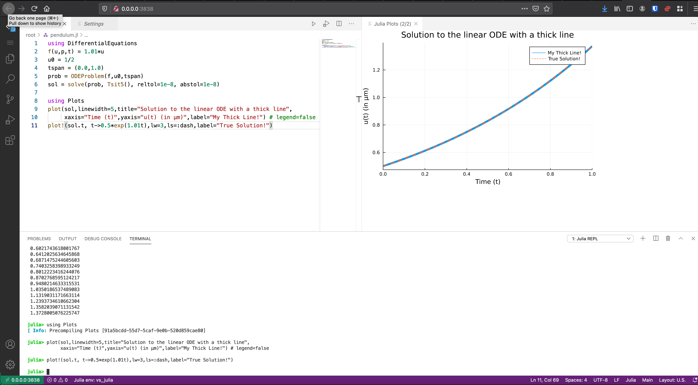

# docker-julia
Docker for Julia server with vscode.



> Do you want to run Julia in a similar fashion to [rocker/rstudio-server?](https://hub.docker.com/r/rocker/rstudio) Do you need a docker for each julia-version/project? If so, this is for you. 

## What does it do?
`docker-julia` creates a docker image with `code-server` (vscode on the browser) that allows you to run a specific julia project on the browser.


## Install 

Download the code from Github. Go to the project directory 

```{bash}
cd docker-julia
```

and build the image:

```{bash}
docker build -t image-julia . 
```

### Custom Project / Manifest

You can build the image with your own Project.toml by changing the one inside `julia_config`. 

### Custom Julia Version 
You can build the docker with a specific julia version by running:
```{bash}
docker build --build-arg JULIA_VERSION=1.5.3 -t image-julia . 
```

## Run

By default, `docker-julia` runs on port `3838`. 

```{bash}
docker run -d -p 3838:3838 --env JULIA_NUM_THREADS=12 --restart=unless-stopped image-julia
```

You can access the container by going to: [http://0.0.0.0:3838](http://0.0.0.0:3838)

Additional options such as setting the number of threads:

```{bash}
docker run -d -p 3838:3838 --env JULIA_NUM_THREADS=12 --restart=unless-stopped image-julia
```